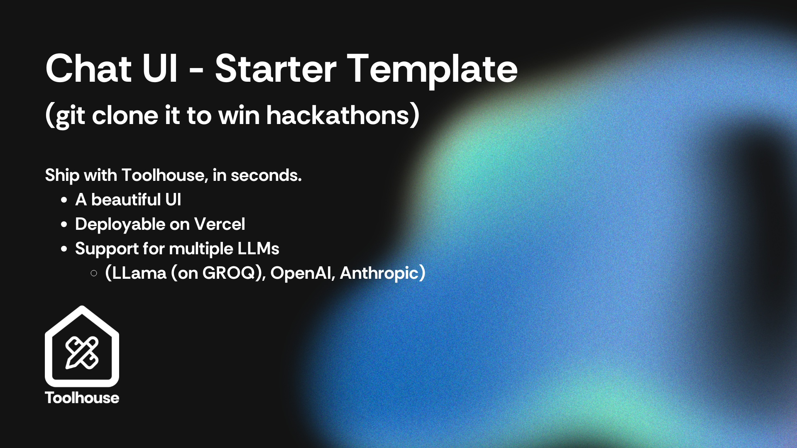

<a href="https://toolhouse.ai/">
  
  <h1 align="center">Toolhouse.ai Chatbot</h1>
</a>

<p align="center">
  An Open-Source AI Chatbot Template with Function calling. Built With Toolhouse and AI SDK on Next.js.
</p>

<p align="center">
  <a href="#features"><strong>Features</strong></a> ·
  <a href="#model-providers"><strong>Model Providers</strong></a> ·
  <a href="#deploy-your-own"><strong>Deploy Your Own</strong></a> ·
  <a href="#running-locally"><strong>Running locally</strong></a>
</p>
<br/>

## Features

- Live reload / Fast Refresh
- TypeScript support
- Support for instant deploy
- Multiple LLMs supported

### Function Calling

With the Toolhouse SDK, you can easily integrate function calling capabilities into your chatbot (or AI app).
This repo also uses the Vercel SDK.
This allows your chatbot to execute predefined functions based on user input, enhancing interactivity and functionality.

Here are some superpowers that Toolhouse can give your LLM, in **1 click**:

- _Scraping_: Use tools for scraping various parts of the internet
- _Code Execution_: Safely execute code in a virtual environment and return the executed code to it
- _Image generation_: Generates **and hosts** images from any prompt
  (and much more if you visit [app.toolhouse.ai](https://app.toolhouse.ai))

Some interesting use-cases powered by Toolhouse's tools:

- Workout scheduler: Tells you what workouts to do based on your needs
- Daily meal planners: Given a list of food available to you, it will give you
- Real Estate Agent: Helps you find properties based on your preferences and budget using memory and real-estate websites
- Customer Support Agent: Provides instant responses to customer queries and issues
- Sales/SDR/Prospecting bots: Assists in lead generation and sales prospecting by searching for information on the internet

This feature empowers your chatbot to perform tasks and provide information dynamically, making it more useful and engaging for users.

## Model Providers

In this starter project you can switch between multiple models - remember that you need to have the right API keys in your environment (or .env.local file)

## Deploy Your Own

You can deploy your own version of the Toolhouse Chatbot to Vercel with one click, and _remember to set your environment variables_:
[](https://vercel.com/new/clone?repository-url=https%3A%2F%2Fgithub.com%2Ftoolhouse%2Fai-chatbot}])

## Running locally

Copy the contents of the file `.env.local.example` to `.env.local`.
After that, you will need to put any environment variables in the file [`.env.local`](.env.local) to run this Chatbot.

> Note: You should not commit your `.env` file or it will expose secrets that will allow others to control access to your various OpenAI and authentication provider accounts.

### Launch everything

```
npm install --legacy-peer-deps
npm run dev
```

Your app template should now be running on [localhost:3000](http://localhost:3000/).
